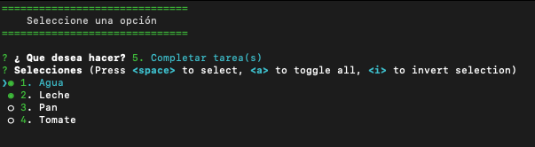

## Aplicación NodeJS de terminal para tareas

Esta aplicación tiene la información persistente mediante un json que escribe con el paquete fs.

### Dependencias

1. [Estilar terminal, colors](https://www.npmjs.com/package/colors)   
2. [Menu terminal, inquirer](https://www.npmjs.com/package/inquirer)   
3. [Generar id único, uuid](https://www.npmjs.com/package/uuid)  

### Imágenes aplicación

